# RISC-V Multi-Cycle Processor (RV32I Subset) — Verilog Implementation

## Overview

I implemented a 32-bit RISC-V multi-cycle processor based on the classical multi-cycle datapath/control approach, following the architecture shown below:

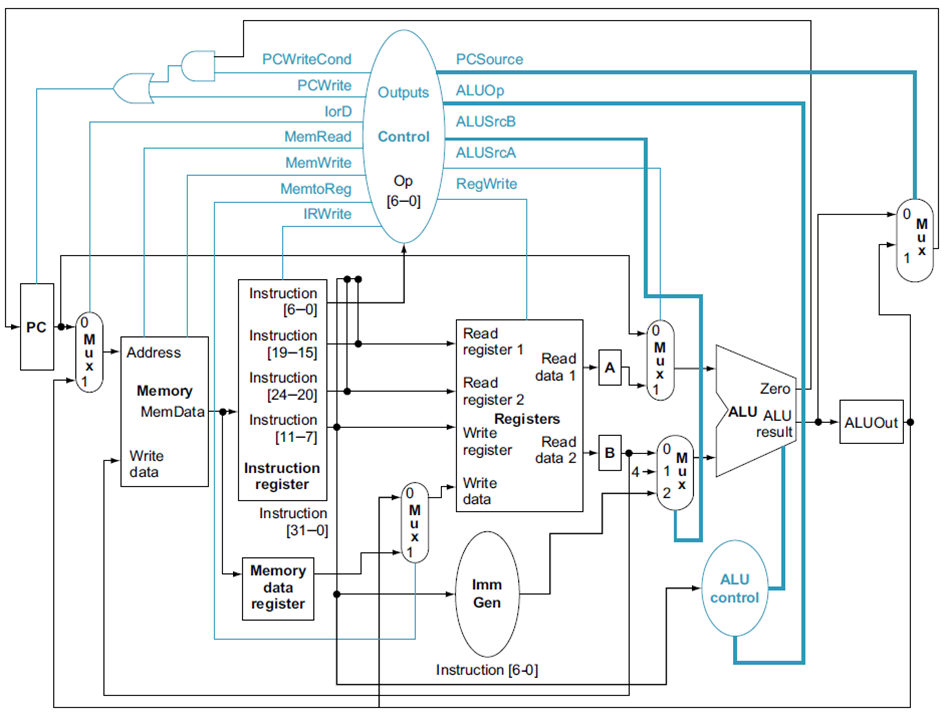

Unlike a single-cycle CPU, this processor executes instructions over **multiple clock cycles**, performing one simple operation per cycle. To preserve values between cycles, the design includes additional registers compared to a single-cycle CPU: **IR** (Instruction Register), **MDR** (Memory Data Register), **A**, **B**, and **ALUOut**, along with extra multiplexers for signal selection. This processor also uses a **single unified memory** for both instructions and data.

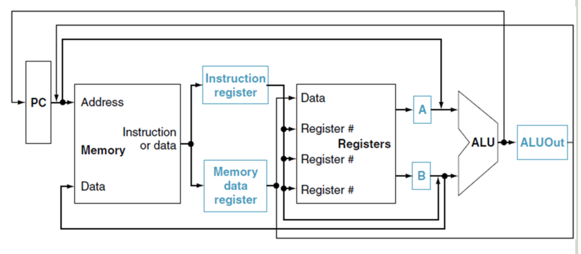
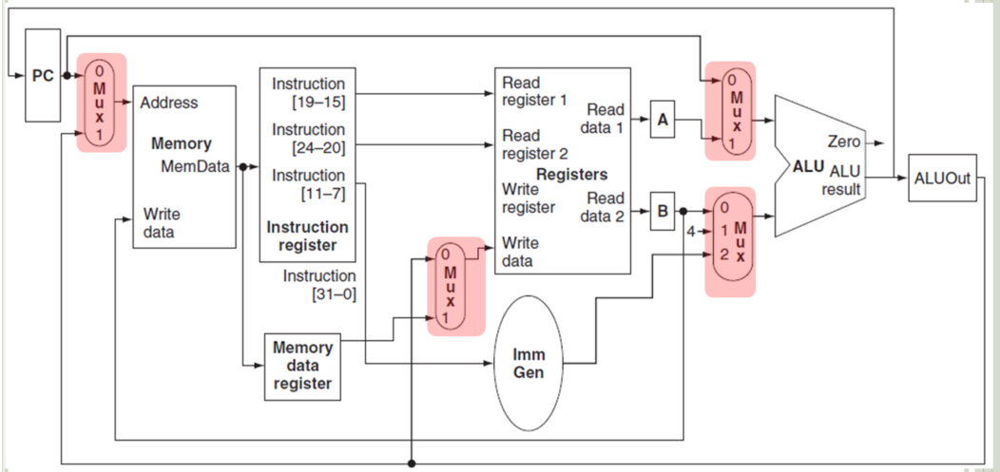

---

## Instruction Execution Steps

For an instruction to complete, it passes through the following stages:

**1. Instruction Fetch** — performed for every instruction
```
IR <= Memory[PC]
PC <= PC + 4
```

**2. Instruction Decode** — decode opcode/funct fields, read register operands, latch into `A` and `B`

**3. Execute** — depending on instruction type:
- Load/Store: `ALUOut <= A + immediate`
- R-type: `ALUOut <= A op B`
- Branch (BEQ): if `(A == B)` then `PC <= ALUOut`

**4. Memory Access / Writeback**
- Store: `Memory[ALUOut] <= B`
- Load: `MDR <= Memory[ALUOut]`
- R-type: `Reg[rd] <= ALUOut`

**5. Load Writeback** *(load only)*
- `Reg[rd] <= MDR`

Depending on instruction type, execution takes **3, 4, or 5 cycles**.

---

## Project Structure

The design is split into two major modules:

- **`datapath`** — implements registers, ALU, muxes, PC logic, memory interface, and register file connectivity
- **`control_path`** — generates all control signals for the datapath, implemented as a **Finite State Machine (FSM)** following the reference multi-cycle control diagram

---

## Functional Verification

To validate correctness, the following RV32I program is executed:
```asm
addi t0, zero, 5      # t0 = 5
addi t1, zero, 3      # t1 = 3
add  t2, t0, t1       # t2 = 8
sub  t3, t0, t1       # t3 = 2

addi s0, zero, 256    # base address = 256
sw   t3, 0(s0)        # store 2
lw   t4, 0(s0)        # load 2

loop:
addi t4, t4, -1       # decrement
beq  t4, zero, end    # if t4 == 0 -> end
beq  zero, zero, loop # unconditional jump back to loop

end:
addi t5, zero, 99
```

The program is encoded in `mem.mem` as:
```
00500293
00300313
006283B3
40628E33
10000413
01C42023
00042E83
FFFE8E93
000E8463
FE000CE3
06300F13
```

---

## Simulation Results

### Instructions loaded correctly in memory

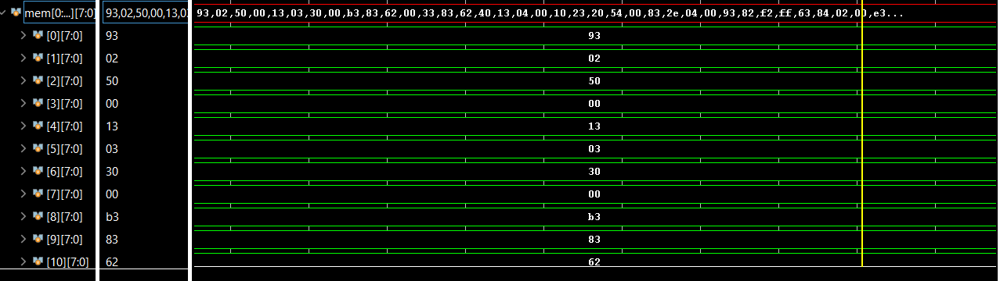

---

### PC and IR behavior during Fetch

The PC increments when transitioning from state 0 to state 1 (PCWrite is asserted), and IR captures the correct instruction from memory.

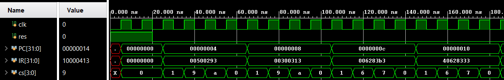

---

### I-type: `addi` (opcode `0x13`)

`addi` follows the expected FSM path **1 → 9 → A → 0**. Control signals change correctly per state and the result is written to the destination register.

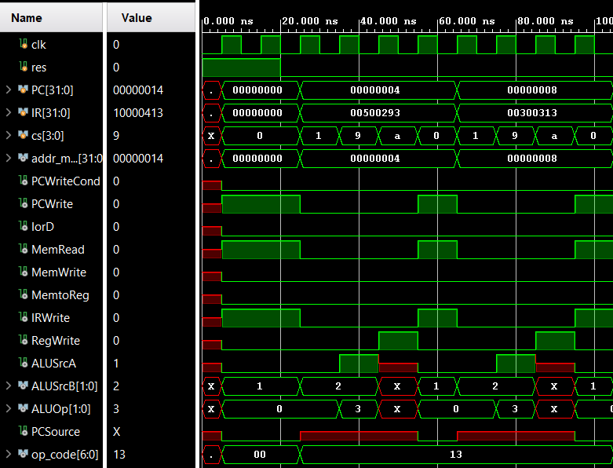
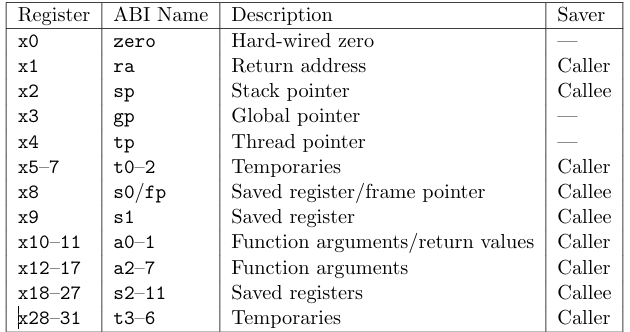
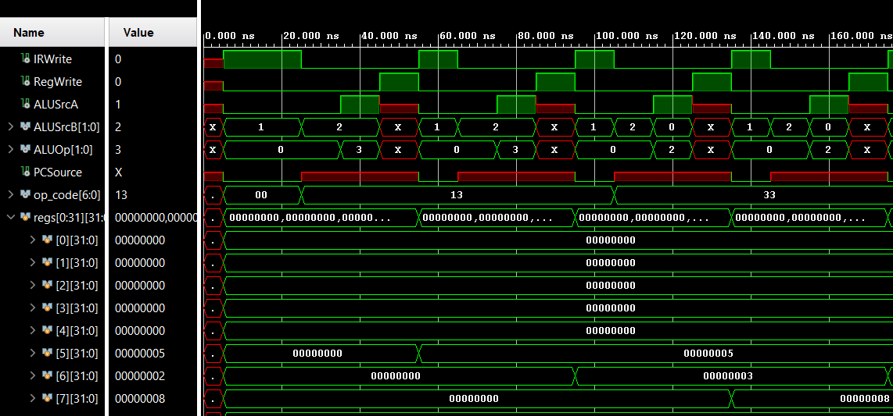

---

### R-type: `add` / `sub` (opcode `0x33`)

R-type instructions follow FSM path **1 → 6 → 7 → 0** and correctly compute and write ALU results.

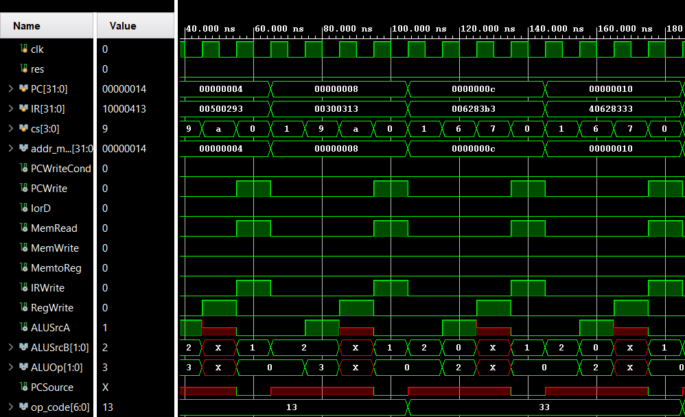
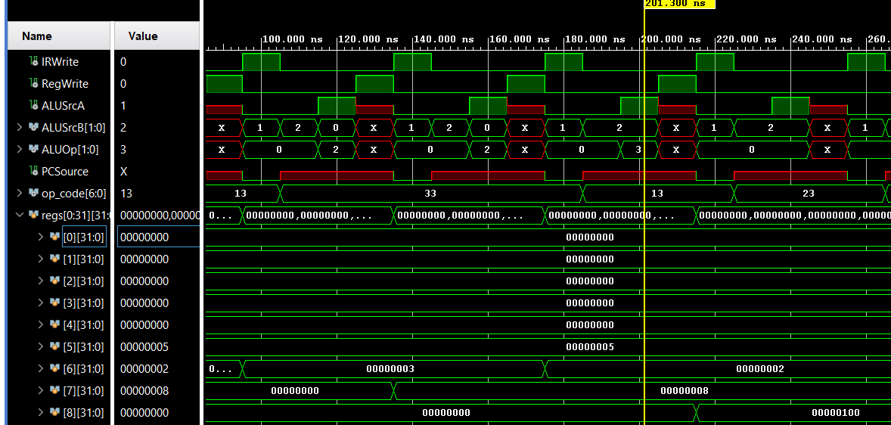

---

### Load/Store: `sw` / `lw` (opcodes `0x23` / `0x03`)

`sw` follows FSM **1 → 2 → 5 → 0** and `lw` follows **1 → 2 → 3 → 4 → 0**.

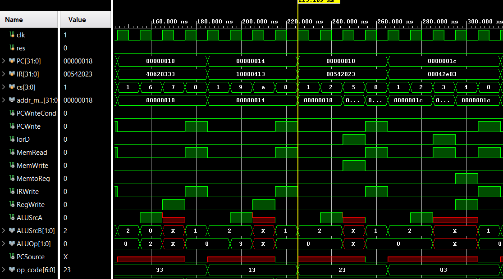

The stored value is visible in data memory at address 256:

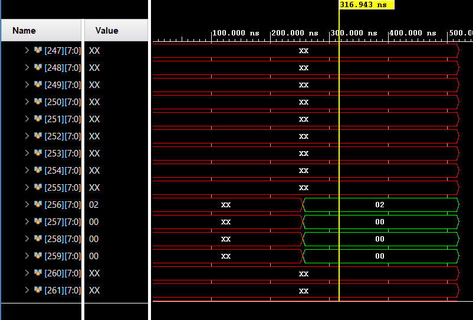

`lw` works correctly — `t4` receives the value `0x02`:

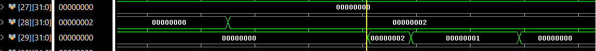

---

### Branch: `beq` (opcode `0x63`)

`beq` follows FSM path **1 → 8 → 0** and correctly updates the PC on a taken branch.

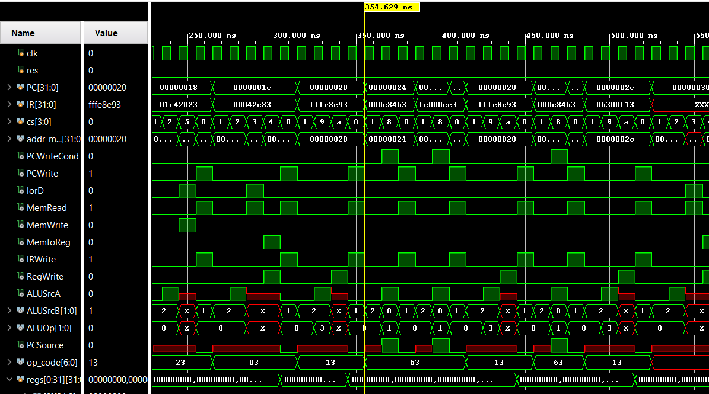

---

## Final Result

To confirm the loop and branch logic executed correctly, at the end of the program `t5` is set to 99 decimal (`0x63` hex):

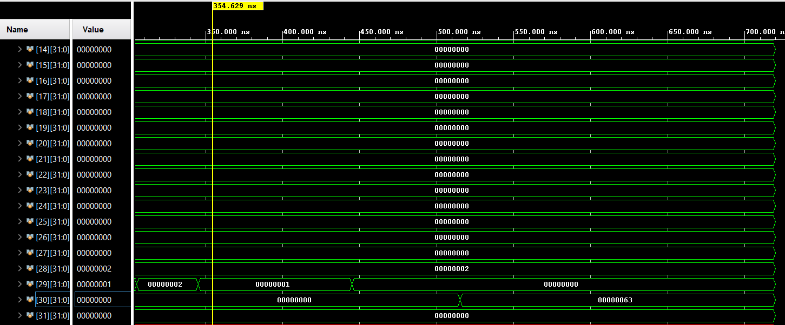