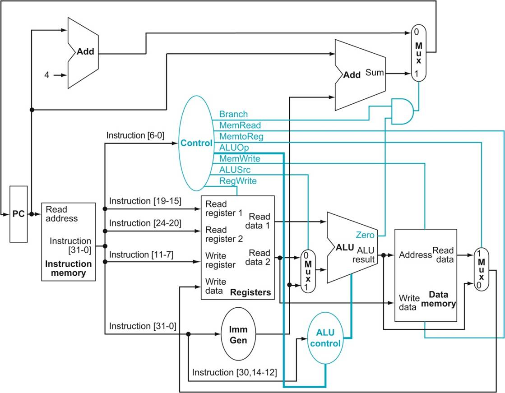
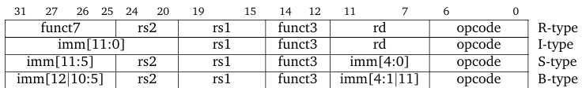
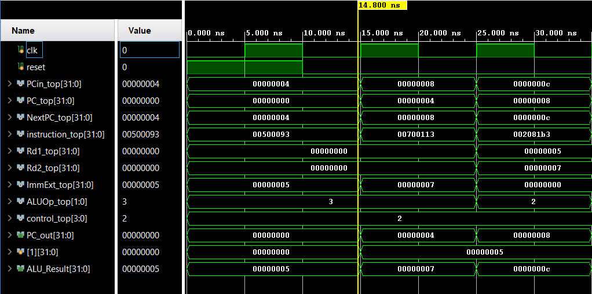
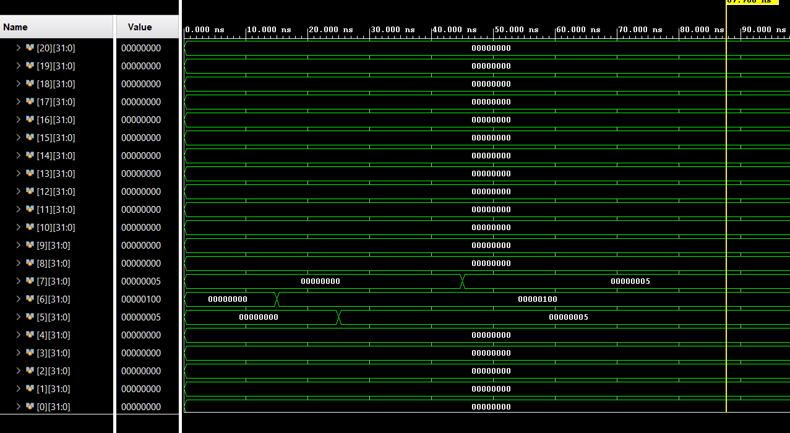
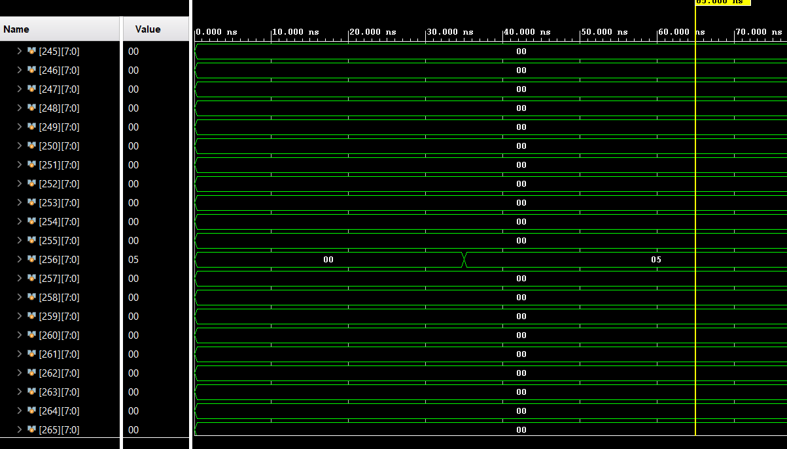
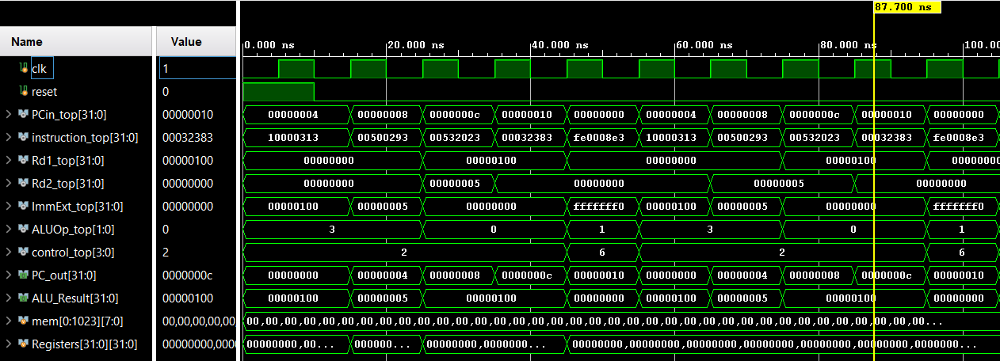

# RISC-V Single Cycle Processor (RV32I Subset)

## Introduction

The goal of this project was to design and implement a 32-bit RISC-V processor in Verilog.

This implementation follows a single-cycle architecture, meaning that each instruction is fully executed within one clock cycle. All stages of instruction execution — instruction fetch, decode, register read, ALU operation, memory access (if required), and write-back — are completed in a single clock period.

Because of this design choice, the clock cycle must be long enough to accommodate the slowest instruction (typically load instructions). While this simplifies control logic and datapath design, it is less efficient compared to multi-cycle or pipelined architectures.

The processor implements a subset of the RV32I instruction set. Only a limited number of instructions were implemented in order to focus on the core datapath and control mechanisms.

## Architecture Overview
The processor follows a classical single-cycle Harvard-style datapath:
- Separate instruction and data memories
- 32 general-purpose registers (x0–x31)
- Byte-addressable data memory

## Implemented Instructions

### R-Type
- ADD
- SUB
- AND
- OR
- XOR

### I-Type
- ADDI
- ANDI
- ORI
- XORI

### Memory
- LW
- SW

### Branch
- BEQ

This subset is sufficient to demonstrate arithmetic operations, memory access, branching logic, and control signal generation.

## Processor Operation

The processor follows the classical single-cycle datapath model. Each instruction passes through the following stages within one clock cycle:

1. Instruction Fetch (IF)  
   The Program Counter provides the address to the Instruction Memory, which outputs the current instruction.

2. Instruction Decode (ID)  
   The Control Unit decodes the opcode and generates the necessary control signals.  
   The Register File reads the source registers (rs1 and rs2).  
   The Immediate Generator extracts and sign-extends the immediate value (if required).

3. Execute (EX)  
   The ALU performs arithmetic or logical operations based on ALUControl signals.  
   For branch instructions, the ALU also determines if the branch condition is satisfied.

4. Memory Access (MEM)  
   For load (LW) and store (SW) instructions, the Data Memory is accessed.

5. Write Back (WB)  
   The result (either from ALU or memory) is written back to the destination register (rd).

## Instruction Formats

The processor supports the following RISC-V instruction formats:

## Instruction Encoding (Supported Subset)

The following table summarizes the instruction encodings supported by this implementation.

| Instruction | FMT | Opcode   | funct3 | funct7   | Description |
|------------|------|----------|--------|----------|-------------|
| ADD        | R    | 0110011  | 000    | 0000000  | rd = rs1 + rs2 |
| SUB        | R    | 0110011  | 000    | 0100000  | rd = rs1 - rs2 |
| AND        | R    | 0110011  | 111    | 0000000  | rd = rs1 & rs2 |
| OR         | R    | 0110011  | 110    | 0000000  | rd = rs1 \| rs2 |
| XOR        | R    | 0110011  | 100    | 0000000  | rd = rs1 ^ rs2 |
| ADDI       | I    | 0010011  | 000    | —        | rd = rs1 + imm |
| ANDI       | I    | 0010011  | 111    | —        | rd = rs1 & imm |
| ORI        | I    | 0010011  | 110    | —        | rd = rs1 \| imm |
| XORI       | I    | 0010011  | 100    | —        | rd = rs1 ^ imm |
| LW         | I    | 0000011  | 010    | —        | rd = M[rs1 + imm] |
| SW         | S    | 0100011  | 010    | —        | M[rs1 + imm] = rs2 |
| BEQ        | B    | 1100011  | 000    | —        | if (rs1 == rs2) PC = PC + imm |

## Module Description

### Program Counter (PC)
Stores the address of the current instruction.  
On each rising clock edge, the PC is updated either with PC+4 or with the branch target address.

### Instruction Memory
Stores program instructions.  
The address from the PC is used to fetch a 32-bit instruction.

### Register File
Contains 32 registers (x0–x31).  
Register x0 is hardwired to zero.  
Supports two simultaneous reads and one write per cycle.

### Immediate Generator
Extracts and sign-extends immediate values based on instruction format (I, S, B).

### Control Unit
Generates control signals based on the opcode field:
- ALUSrc
- MemtoReg
- RegWrite
- MemRead
- MemWrite
- Branch
- ALUOp

### ALU Control
Determines the ALU operation using ALUOp and funct3/funct7 fields.

### ALU
Performs arithmetic and logical operations (ADD, SUB, AND, OR, XOR).

### Data Memory
Used for load (LW) and store (SW) instructions.

### Branch Logic
Determines whether the branch is taken using:
Branch AND Zero

## The testbench:
- Decodes each instruction
- Computes expected ALU results
- Verifies write-back values
- Verifies memory writes and loads
- Checks PC increment and branch logic
- Stops simulation on first mismatch

This ensures instruction-level architectural correctness rather than only checking final register states.

## Execution Example

00500093   # addi x1, x0, 5  
00700113   # addi x2, x0, 7  
002081B3   # add  x3, x1, x2  
0020A023   # sw x2, 0(x1)
0000A183   # lw x3, 0(x1)
00208663   # beq x1, x2, label

Consider the instruction:

00500093   # addi x1, x0, 5

This instruction adds the immediate value 5 to register x0 and stores the result in register x1.

### Step-by-step execution

1. Instruction Fetch (IF)  
   The Program Counter (PC) provides address 0 to the Instruction Memory.  
   The fetched instruction is `0x00500093`.

2. Instruction Decode (ID) 
   - opcode = `0010011` → I-type ALU instruction  
   - rs1 = x0  
   - rd = x1  
   - immediate = 5  

   The Control Unit sets:
   - ALUSrc = 1  
   - RegWrite = 1  
   - MemRead = 0  
   - MemWrite = 0  
   - Branch = 0  
   - ALUOp = 11  

3. Execute (EX)  
   The ALU performs:
   
   x0 + 5 = 0 + 5 = 5  

   ALU_Result = 5

4. Memory Stage (MEM)  
   Not used (no memory access).

5. Write Back (WB)  
   Since MemtoReg = 0, the ALU result is written back to register x1.

After execution:
- x1 = 5  
- PC = PC + 4

Consider the following program:

10000313   # addi t1, zero, 256
00500293   # addi t0, zero, 5
00532023   # sw   t0, 0(t1)
00032383   # lw   t2, 0(t1)
FE0008E3   # beq  zero, zero, -16

### Register Update Verification

It can be observed that registers **t0 (x5)**, **t1 (x6)** and **t2 (x7)** are updated correctly during program execution.

- `t1 (x6)` is initialized with the base address `256`
- `t0 (x5)` receives the value `5`
- `t2 (x7)` correctly loads the stored value from memory

### Store Instruction Verification (`sw`)

The `sw` instruction functions correctly by writing the value stored in **t0 (x5)** into data memory at byte address `256`.

The waveform confirms that the correct value is saved in memory.

### Branch Instruction Verification (`beq`)

The `beq` instruction operates correctly.  
The Program Counter follows the expected sequence:  0-4-8-12-16-0

This confirms that:

- The branch condition is evaluated correctly
- The immediate value is properly sign-extended
- The PC update logic functions as intended
- The processor successfully loops back to the beginning of the program

